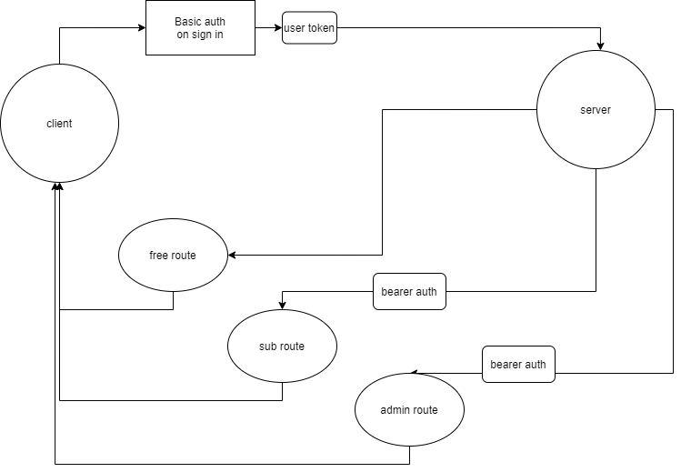

# auth-api

## LAB - Class 07

## Project: basic auth

### Author: Ricardo Barcenas

### Links and Resources

- [ci/cd](https://github.com/401-advanced-javascript-ricardo-b/auth-api/actions) (GitHub Actions)
- [Heroku Production Deployment](https://ricardob-auth-api.herokuapp.com/)
- [Pull request](https://github.com/401-advanced-javascript-ricardo-b/auth-api/pull/1)

### Setup

#### `.env` requirements (where applicable)

- `PORT` - 3000
- `MONGODB_URI` - mongodb://localhost:27017/auth_api
- `SECRET` - verysecretsecret

#### How to initialize/run your application (where applicable)

- `npm start` to start the app

#### How to use your library (where applicable)

#### Tests

- How do you run tests?
  -  `npm test` to run the tests
- Any tests of note?
  - 

- Describe any tests that you did not complete, skipped, etc
  - app.listen needs a test

#### UML

